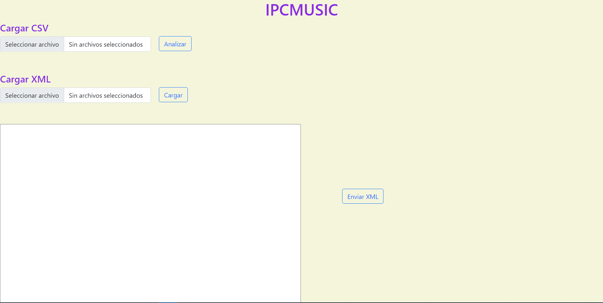
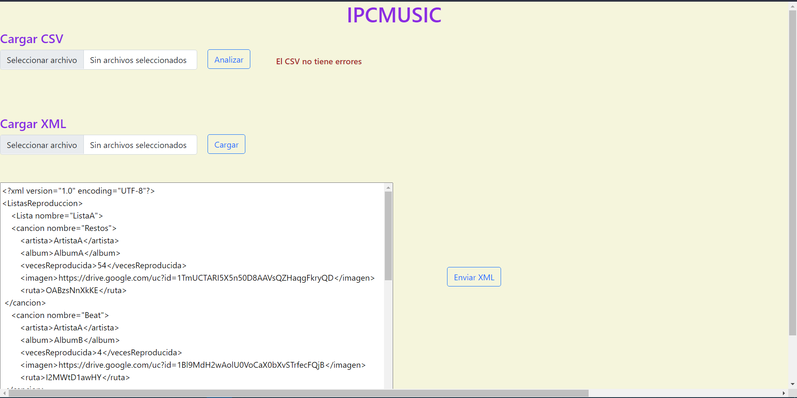
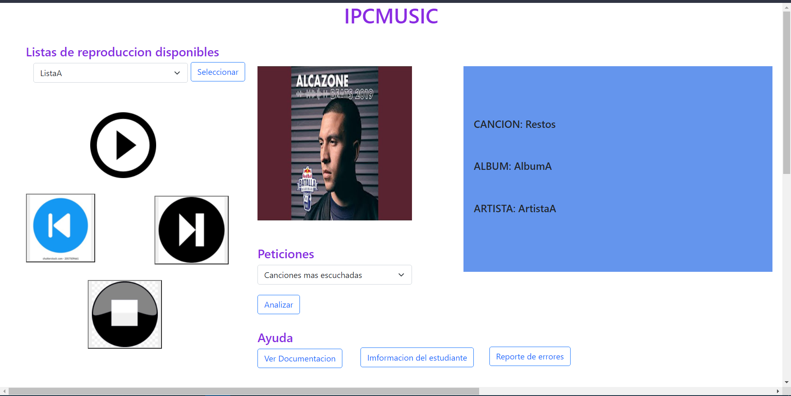
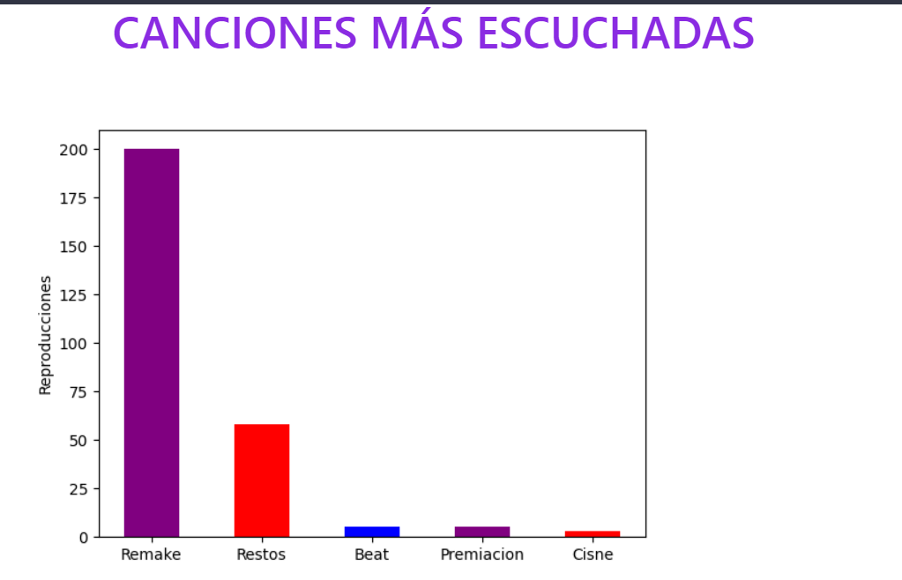
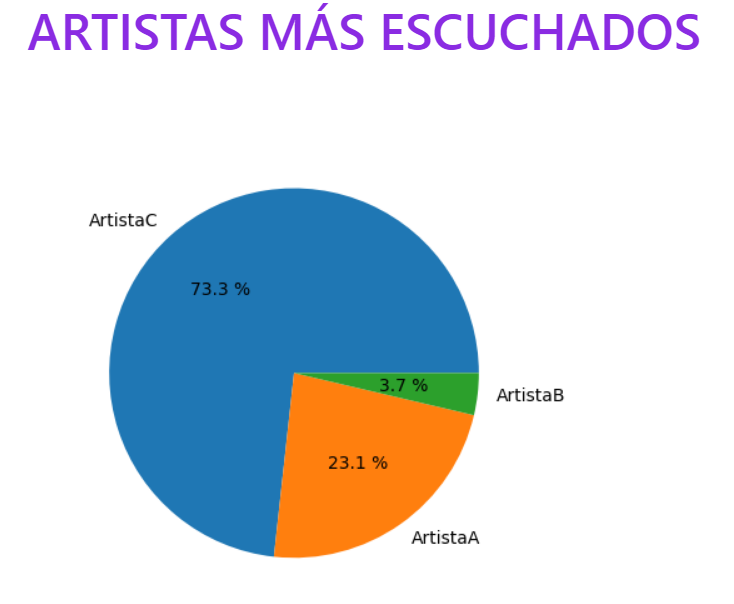
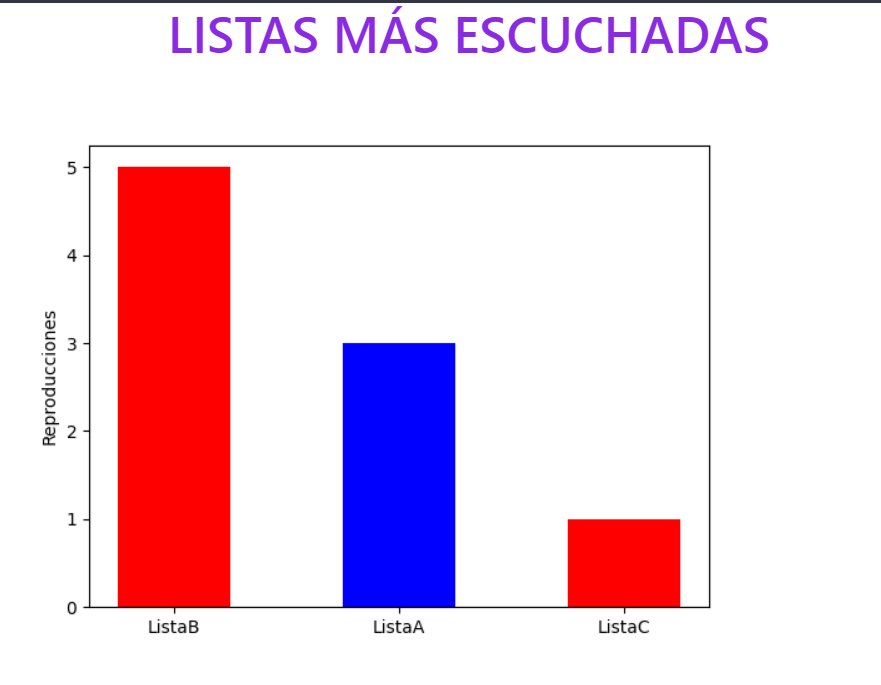
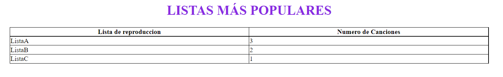

# **IPC2_PROYECTO2DICIEMBRE_201903909**

El reproductor fue desarrollador utilizando django para frontend y flask como backend

___

Al iniciar la aplicación se ve de la siguiente manera:

____

## Cargar CSV permite la carga de datos en la aplicación. La estructura de los datos es la siguiente:

~~~csv
Nombre,Cancion,Artista,Album,Reproducciones,Ruta,Imagen
ListaA,Restos,ArtistaA,AlbumA,54,OABzsNnXkKE,https://drive.google.com/uc?id=1TmUCTARI5X5n50D8AAVsQZHaqgFkryQD
ListaB,Cisne,ArtistaB,AlbumA,2,GpDlbNYyAEU,https://drive.google.com/uc?id=11bl1wNnR78VdUsj8NJS_n6gsd1YbFmHa
ListaA,Beat,ArtistaA,AlbumB,4,I2MWtD1awHY,https://drive.google.com/uc?id=1Bl9MdH2wAolU0VoCaX0bXvSTrfecFQjB
ListaB,Remake,ArtistaC,AlbumB,200,FWm8OHi1AO0,https://drive.google.com/uc?id=1UmAEoyia-NbmUN4xI-4PHUpTgFy7BAWs
ListaC,Premiacion,ArtistaB,AlbumC,2,Ho4YFqlpZp4,https://drive.google.com/uc?id=102NqRSa20Wg02X5G1Gl6sOLLMfzgP8rV
ListaA,Squad,ArtistaB,AlbumA,1,qAulP7p3tOQ,https://drive.google.com/uc?id=18jPKD3ELa1gXJysrMlHdYk6KVmSSxNYz
~~~

Los archivos CSV deben estar en google drive.

Al darle al boton "Analizar" si el archivo no tiene errores se mostrara un el archivo csv convertido a xml en la caja de texto.

___

## Enviar XML

Se envian los datos y se crean las listas de reproduccion, redirigiendo a la siguiente pantalla.

____

## Pantalla de reproduccion

En esta pantalla se puede seleccionar lista de reproduccion y reproducir canciones.

Tambien tiene un apartado de peticiones que son las que hacen a la api de flask, estan las siguientes opciones:

- Canciones mas escuchadas
- Artistas mas reproducidos
- Listas mas escuchadas
- Listas mas populares

Al seleccionar una de estas opciones y darle al boton "Analizar" se hará una grafica con los datos.

Por ultimo tambien se puede observar la documentacion y la informacion del desarrollador